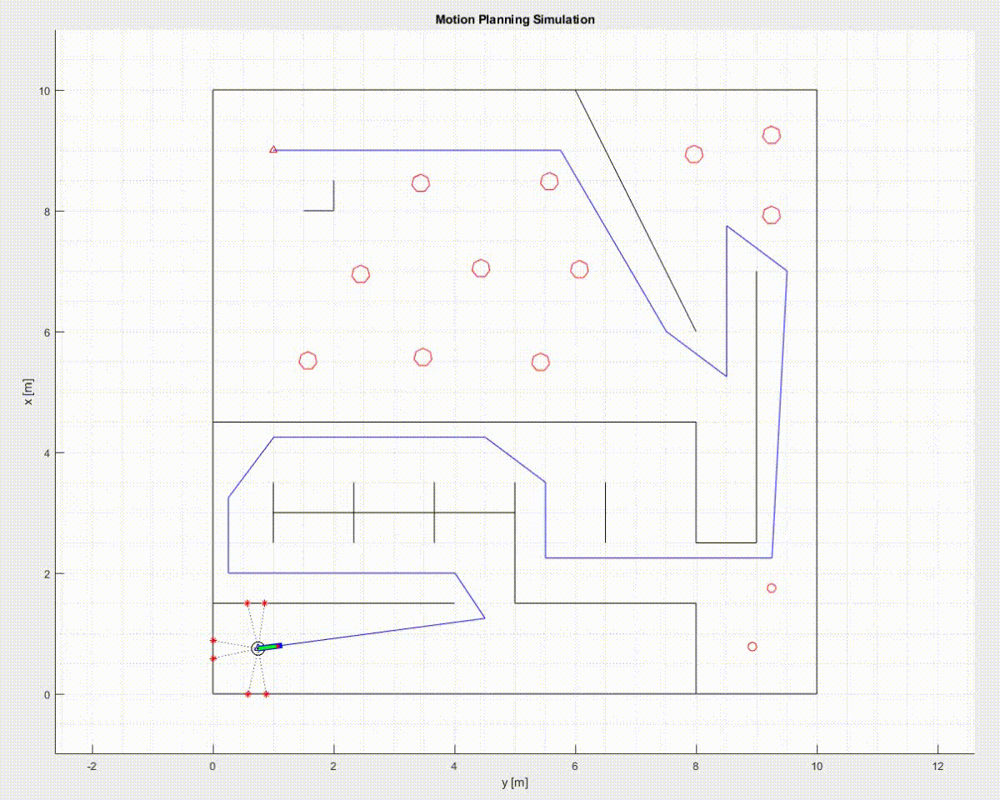
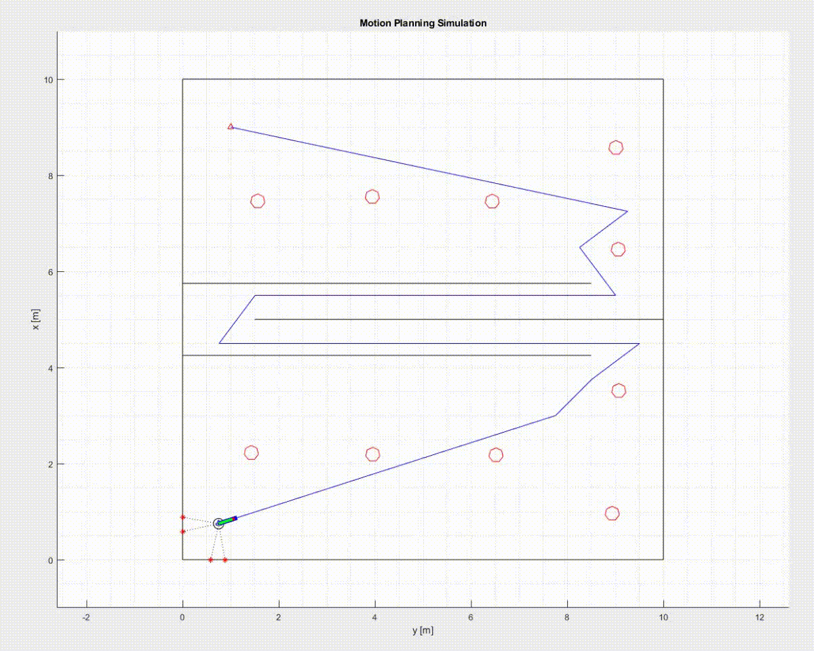

Motion Planning Simulation

This repository contains a MATLAB simulation for motion planning that integrates obstacle avoidance and path planning algorithms. The simulation is designed for research and educational purposes, and is part of my paper published in the Journal of Robotics and Mechatronics [link](https://doi.org/xxxxxx).
The algorithm is the same as the one described in my research paper, but the map, obstacles, and simulation scenario here are different to avoid duplication of the paper's figures and results.

Features and Files
- **motionplanning.m**  
  Main script to run the entire simulation combining all components.
- **obstacleavoidance.m**, **obstacleavoidance_mex.mexw64**  
  Obstacle avoidance algorithm (MATLAB and faster MEX compiled version).
- **pathplanning.m**, **pathplanning_mex.mexw64**  
  Path planning algorithm (MATLAB and faster MEX compiled version).
- **updateobstacle.m**, **updateobstacle_mex.mexw64**  
  Updates positions of dynamic obstacles during simulation.
- **wallnodes.mat**, **wallnodes2.mat**, **obsnodes.mat**, **obsnodes2.mat**  
  Data files containing map and obstacle nodes for different simulation setups.

How to Run the Simulation

1. Clone or download this repository, then extract the files.
2. Open MATLAB and navigate to the repository folder.
3. Open `motionplanning.m`.
4. Run the script (press **F5** or click the *Run* button in MATLAB).
5. The simulation window will launch and begin running automatically.

Demo

Below are examples the simulation in action (different scenario from the paper):

(Algorithm same as in the paper, but with a different map and obstacles.)

License

This work is licensed under the MIT license and is provided for academic purpose. See LICENSE for details.

Citation

If you use this code in your research, please cite:
[Your Name], "Title of Paper," Journal of ABC, Year.

Doi: (https://doi.org/xxxxxx)
